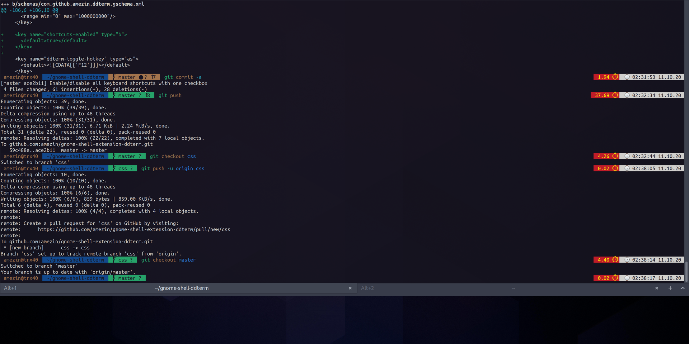
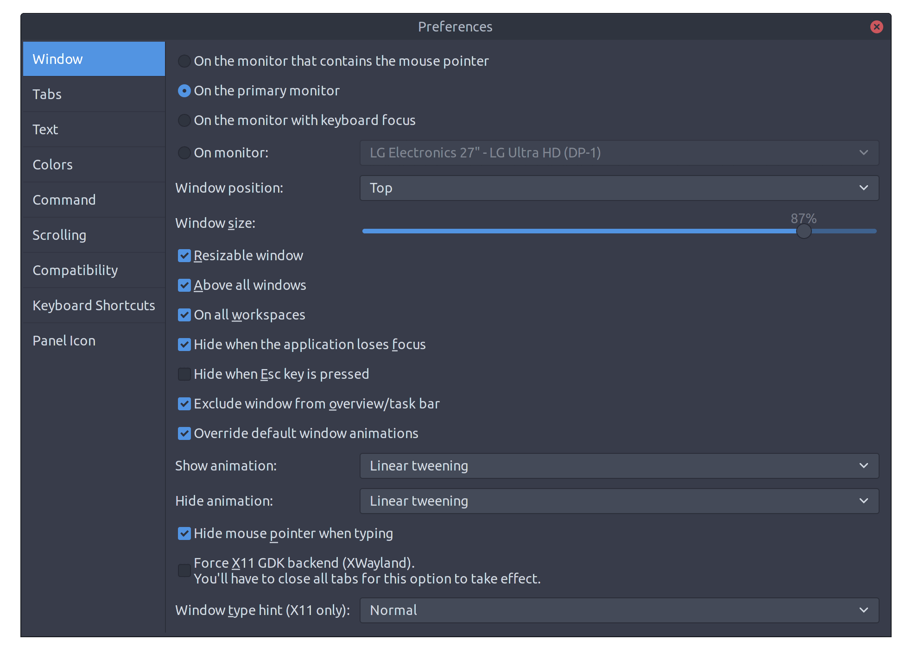

# Another Drop Down Terminal Extension for GNOME Shell

[extensions.gnome.org]

Inspired by

- https://github.com/bigbn/drop-down-terminal-x

- https://github.com/Guake/guake

## Distinguishing features

- Runs on Wayland natively

- Terminal window can be resized by dragging the border with mouse

- `Preferences` window with a lot of different settings

## Installing

The easiest way to install the extension is to go to [extensions.gnome.org].

However, review process on [extensions.gnome.org] is kinda slow, so a new
release may be available here on GitHub, but not on [extensions.gnome.org] yet.

[extensions.gnome.org]: https://extensions.gnome.org/extension/3780/ddterm/

If you want to install from GitHub:

### 1. Install the extension to `~/.local/share/gnome-shell/extensions`

#### Install a released version

You can download a released version from
[Releases](https://github.com/amezin/gnome-shell-extension-ddterm/releases)
page. You need the file `ddterm@amezin.github.com.shell-extension.zip`.

Or, you can download a prebuilt package for a branch from
[Github Pages](https://amezin.github.io/gnome-shell-extension-ddterm/#prebuilt-extension-packages).

Download it, then run:

    $ gnome-extensions install -f /path/to/ddterm@amezin.github.com.shell-extension.zip

#### Install from `git` repository

`git clone` the repository into arbitrary location, and run `make install`:

    $ git clone https://github.com/amezin/gnome-shell-extension-ddterm.git
    $ cd gnome-shell-extension-ddterm
    $ make install

It will build the extension package and install it.

Or you can simply symlink the repository into extensions directory.
`make develop` will do it:

    $ git clone https://github.com/amezin/gnome-shell-extension-ddterm.git
    $ cd gnome-shell-extension-ddterm
    $ make develop

Or you can `clone` the repository directly into `~/.local/share/gnome-shell/extensions`:

    $ mkdir -p ~/.local/share/gnome-shell/extensions
    $ cd ~/.local/share/gnome-shell/extensions
    $ git clone https://github.com/amezin/gnome-shell-extension-ddterm.git ddterm@amezin.github.com
    $ cd ddterm@amezin.github.com
    $ make schemas/gschemas.compiled

### 2. Restart Gnome Shell

On Wayland you have to log out and log in back.

On X11, you can restart the shell by pressing `Alt+F2`, `r`, `Enter`

### 3. Enable the extension

Enable the extension using `gnome-tweaks`, or:

    $ make enable

in the cloned repository.
