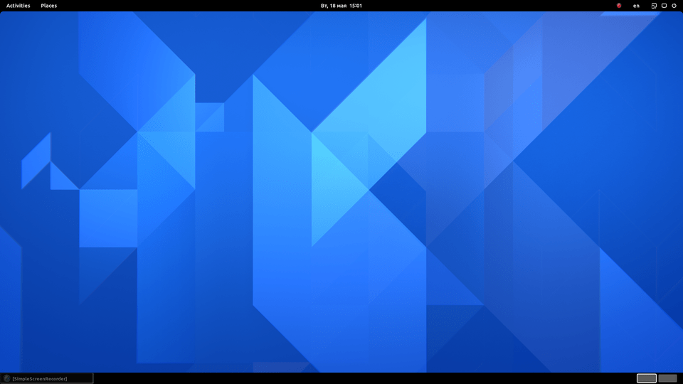
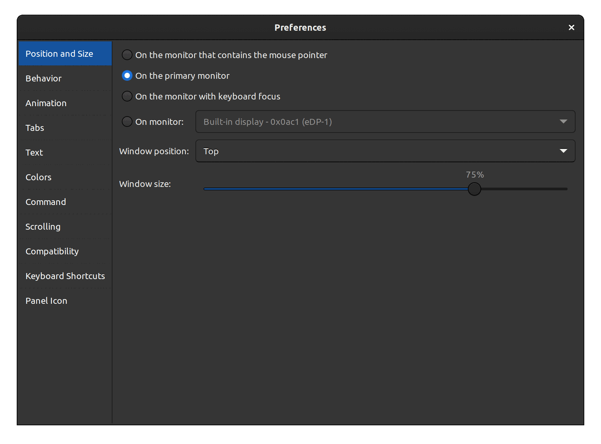

<!--
SPDX-FileCopyrightText: 2020 Aleksandr Mezin <mezin.alexander@gmail.com>

SPDX-License-Identifier: GPL-3.0-or-later
-->

# Another Drop Down Terminal Extension for GNOME Shell

[%20downloads&logo=gnome&label=extensions.gnome.org)][extensions.gnome.org]

Inspired by

- <https://github.com/bigbn/drop-down-terminal-x>

- <https://github.com/Guake/guake>

## Distinguishing features

- Runs on Wayland natively

- Can be controlled from the [command line](docs/cmdline.md)

- Terminal window can be resized by dragging the border with mouse

- All tabs are restored automatically after restart

- `Preferences` window with a lot of different settings

## Review by [TechHut](https://www.youtube.com/channel/UCjSEJkpGbcZhvo0lr-44X_w)

## Installing

The easiest way to install the extension is to go to [extensions.gnome.org].

However, the review process on [extensions.gnome.org] is sometimes slow.
A new release may be available here on GitHub, but not on
[extensions.gnome.org] yet.

[extensions.gnome.org]: https://extensions.gnome.org/extension/3780/ddterm/

If you want to install from GitHub: see [docs/INSTALL.md](docs/INSTALL.md)

## Contribute

Pull requests are always welcome.

See [docs/CONTRIBUTING.md](docs/CONTRIBUTING.md).

## Translations

You could help translating the user interface using
[Weblate](https://hosted.weblate.org/engage/gnome-shell-extension-ddterm/),
or by opening a pull request on GitHub.

See [docs/Translations.md](docs/Translations.md).
